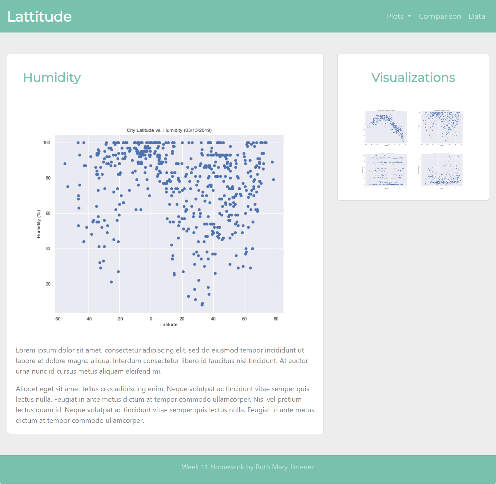
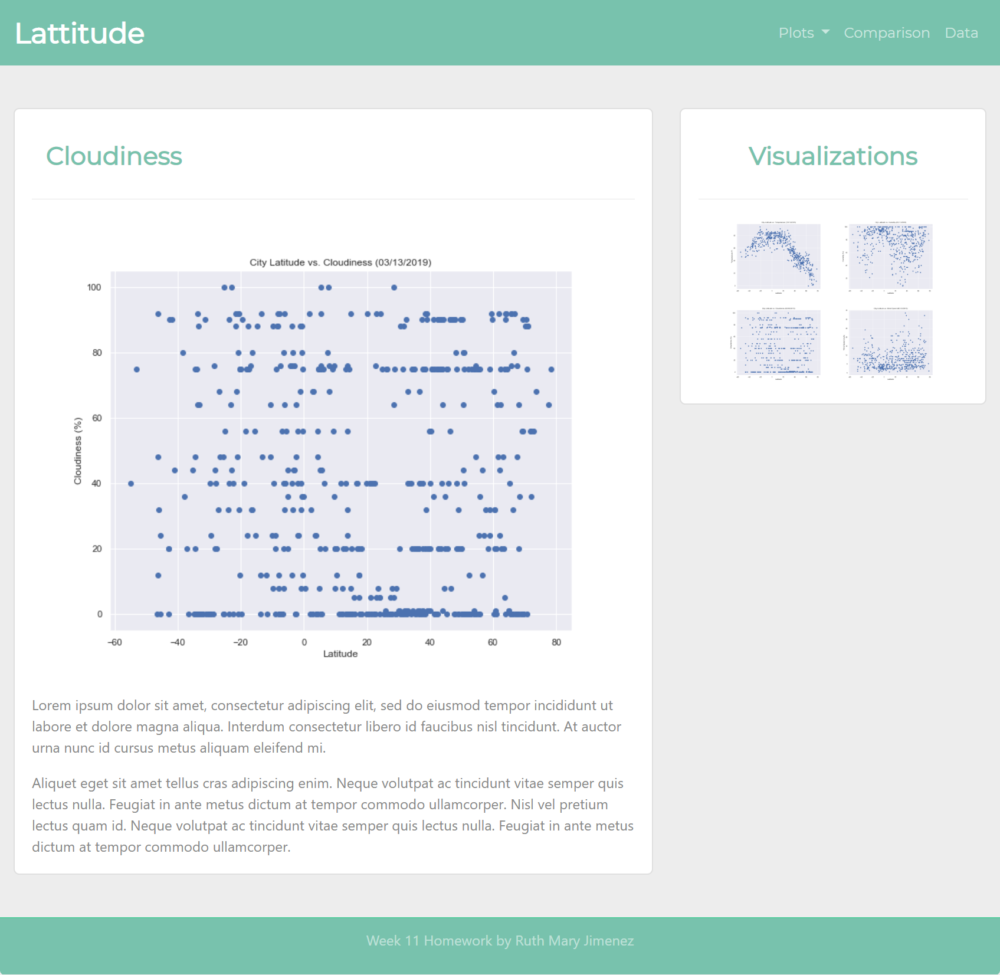

# HTML, CSS and Bootstrap Homework

I was required to create a mini-site using my new HTML, CSS and integration of Boostrap skills gaianed on week 11

----------------------------------------------------------------------

# Homepage

The screenshot above represents my site's homepage
- An explanation of the project.
- Links to each visualizations page.


```python
from IPython.display import Image
Image(filename='images/homepage.png')
```


# "Comparisons" page

Contains all of the visualizations on the same page so we can easily visually compare them.
Uses a bootstrap grid for the visualizations.
The grid must be two visualizations across on screens medium and larger, and 1 across on extra-small and small screens.


```python
Image(filename='images/comparison.png')
```


# Data Page

A "Data" page that:
- Displays a responsive table containing the data used in the visualizations.
- The table must be a bootstrap table component.
- The data must come from exporting the .csv file as HTML, or converting it to HTML. You may use a csv-to-html table conversion tool, e.g. ConvertCSV.


```python
Image(filename='images/data.png')
```


# Visualization Pages

The page should contain 
- A descriptive title and heading tag.
- The plot/visualization itself for the selected comparison.
- A paragraph describing the plot and its significance.


```python
Image(filename='images/temperature.png')
```


```python
Image(filename='images/humidity.png')
```





```python
Image(filename='images/cloudiness.png')
```





```python
Image(filename='images/windspeeds.png')
```


```python

```
